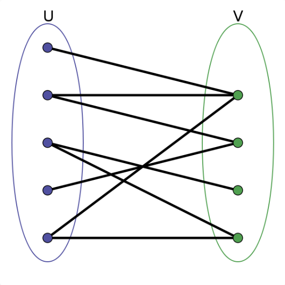

# 图相关的笔记

## 1.基础

- **逻辑结构：** 类似于树的结构，每个结点储存自身值和相邻的边；
- **图的存储：** 邻接表、邻接矩阵。
    -   邻接表：将某节点的邻居存到一个列表里，然后把该节点与这个列表关联起来；
        - 优点：储存空间小；
        - 缺点：不能快速判断两个点是否相邻。 
    - 邻接矩阵： 一个二维数组，位置（x，y）储存结点x与结点y的边的关系。
        - 优点：能快速判断两个点是否相邻；
        - 缺点：储存空间大。
    
- **图的遍历**： 本质就是多叉树的遍历，需要加visited结点防止重复遍历

> 两种多叉树的遍历：

~~~ java
void traverse(TreeNode root) {
    if (root == null) return;
    System.out.println("enter: " + root.val);
    for (TreeNode child : root.children) {
        traverse(child);
    }
    System.out.println("leave: " + root.val);
}

void traverse(TreeNode root) {
    if (root == null) return;
    for (TreeNode child : root.children) {
        System.out.println("enter: " + child.val);
        traverse(child);
        System.out.println("leave: " + child.val);
    }
}
~~~

两种的区别是：第一种能遍历到根节点，第二种不能遍历到根节点；
回溯算法一般使用第二种，因为只关心树枝而不是根。

## 2.拓扑排序详解及运用
### 1). 环检测算法
首先把给出的图有邻接表或者邻接矩阵重构出来。

- **DFS:**
    -   Solution_207的DFS算法。
    - 先重构graph，然后用visited和onpath的布尔值数组，
    分别记录是否遍历过和当前DFS遍历的路径。
    - 进入某结点的时候，onpath和visited的当前结点为true。
    出结点时设onpath为false，即回溯法。
    - 进入节点时发现onpath的该节点为true，则说明当前路径有环，也就是图有环。
    - 当visited为true时，说明该结点往下已经遍历过了，无需继续遍历。
    - 完成了DFS算法。

- **BFS**
    - 先保存每个节点的入度，初始入度为0的节点可认为是起始节点；
    - 将起始节点保存到队列中，作为每个树的第一层；
    - 遍历队列取出节点，每取出一个结点，将其下一个节点的入度减一；
    - 当入度减为0，说明前置节点都已经满足，加入到队列中。

### 2). 拓卜排序算法 

- **DFS**
    - 使用DFS算法的时候，应该想办法保存路径信息；
    - 在后序遍历的位置添加节点到结果列表，可以得到有向无环图的后序遍历序列；
    - 反转后续遍历序列即可得到拓卜排序；
    - visited可以保证不会走重复的节点。

- **BFS**
    - 因为BFS是按层遍历，也就是当遍历到节点的时候表示该节点已经满足了所有的前置条件；
    - 直接在遍历的时候记录节点即可。

## 3.二分图

### 1） 二分图的基础

>**百度百科**：二分图的顶点集可分割为两个互不相交的子集，
>图中每条边依附的两个顶点都分属于这两个子集，
>且两个子集内的顶点不相邻。



如图，将图变为近似神经网络上下两层一样的关系。

- 不一定所有的图都是二分图
- 用做储存索引和反索引


**判定算法：**

- 首先是要进行图的遍历；
- 使用visited数组判断是否走过；
- 若没走过，则染成与当前节点不同的颜色；
- 若走过，则判定颜色是否相同；
- 这里判定颜色以及染色的代码可以放在进入子节点后，也可放在进入节点前（简化代码）。


## 4.并查集（Union-Find）

- 用于解决图的动态联通性的问题

### 1） 基本思路

并查集的算法主要需要实现的功能有：

- 将p和q连接；
- 判断p和q是否连通；
- 返回图中有多少个连通分量。


具体实现：

- 使用数组的方式实现；
- 数组对应项表示该节点的上一级节点是哪个（按树状来储存）；
- 递归查找可找到某节点的根结点；
- 连接两个结点时，将其中一个的根节点连到另一个节点上（合并树）。

注意，==根节点的上一级结点还是自己==


### 2） 优化方法

平衡性优化：关键在于union的过程

优化算法：

1. 平衡性优化：

   1. 因为合并树时可能会将很长的树连接到小树下，导致深度增加，增加查询时间；
   2. 使用数组记录每个根节点下的树的size；
   3. 连接时将小树连到大树下，保证树的平衡。

2. 路径压缩：

   1. 因为该算法不在乎树的结构，重点在于结点的根在哪；

   2. 可以尽量压缩树，使其高度为常数；

   3. 可在find算法中进行优化：将某节点连到该节点父节点的上一级结点下，即上移一级；

   4. 即每调用一次find都会压缩一次，树的深度不会超过2，增加的压缩使用的时间也只是常数级。

   5. ```java
      private int find(int x) {
          while (parent[x] != x) {
              // 这行代码进行路径压缩
              parent[x] = parent[parent[x]];
              x = parent[x];
          }
          return x;
      }
      ```

3. 另一种路径压缩：

   1. 思想同上；

   2. 压缩时将该节点连接到根节点；

   3. 算法较上一种效率更高，因为在递归的过程中，只进行了一次从叶节点到根节点的查找，而且会直接将所有其他节点连到根节点，而上个算法不能一次查找就实现压缩。

   4. ```java
      public int find(int x) {
          if (parent[x] != x) {
              parent[x] = find(parent[x]);
          }
          return parent[x];
      }
      ```

**一般的UF算法：**

```java
class UF {
    // 连通分量个数
    private int count;
    // 存储每个节点的父节点
    private int[] parent;

    // n 为图中节点的个数
    public UF(int n) {
        this.count = n;
        parent = new int[n];
        for (int i = 0; i < n; i++) {
            parent[i] = i;
        }
    }
    
    // 将节点 p 和节点 q 连通
    public void union(int p, int q) {
        int rootP = find(p);
        int rootQ = find(q);
        
        if (rootP == rootQ)
            return;
        
        parent[rootQ] = rootP;
        // 两个连通分量合并成一个连通分量
        count--;
    }

    // 判断节点 p 和节点 q 是否连通
    public boolean connected(int p, int q) {
        int rootP = find(p);
        int rootQ = find(q);
        return rootP == rootQ;
    }

    public int find(int x) {
        if (parent[x] != x) {
            parent[x] = find(parent[x]);
        }
        return parent[x];
    }

    // 返回图中的连通分量个数
    public int count() {
        return count;
    }
}
```

